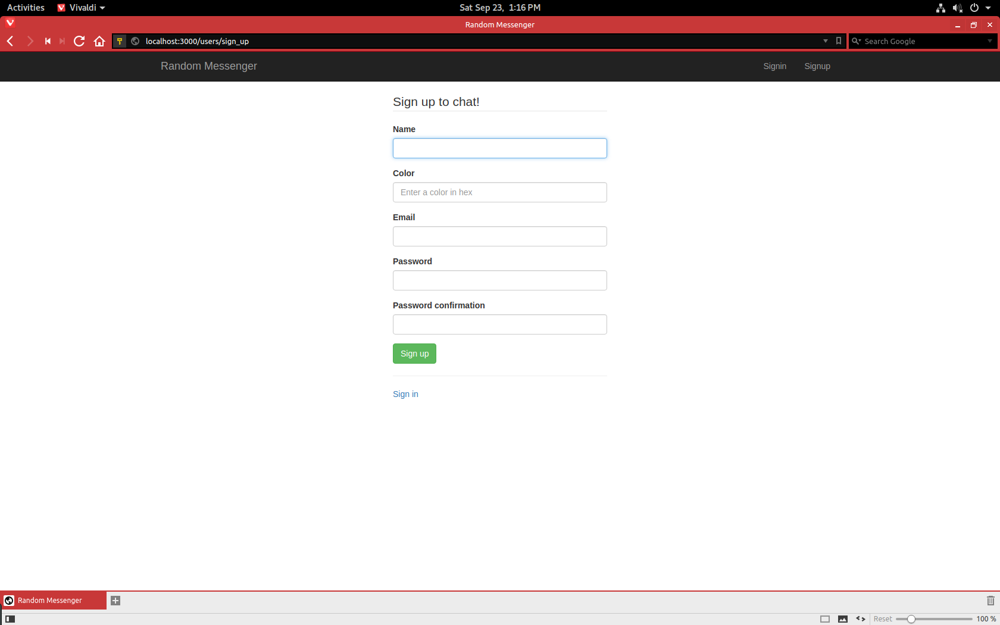
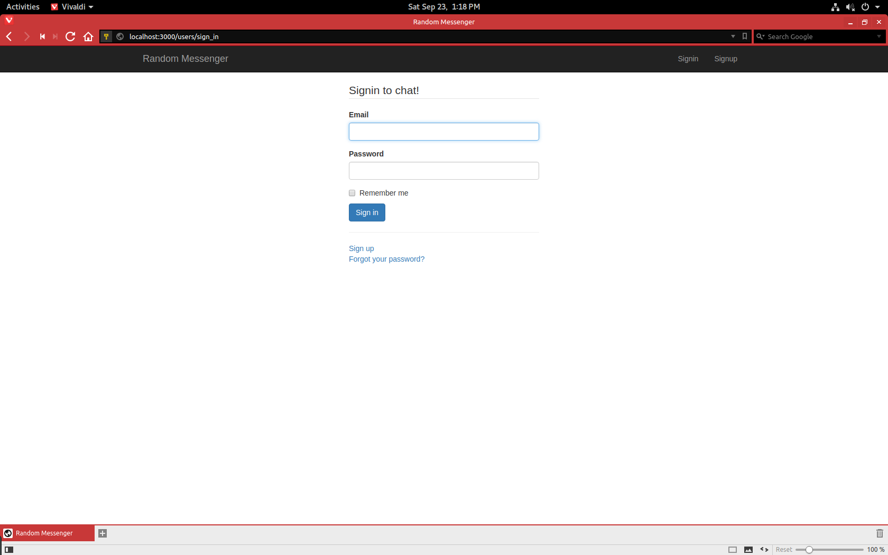
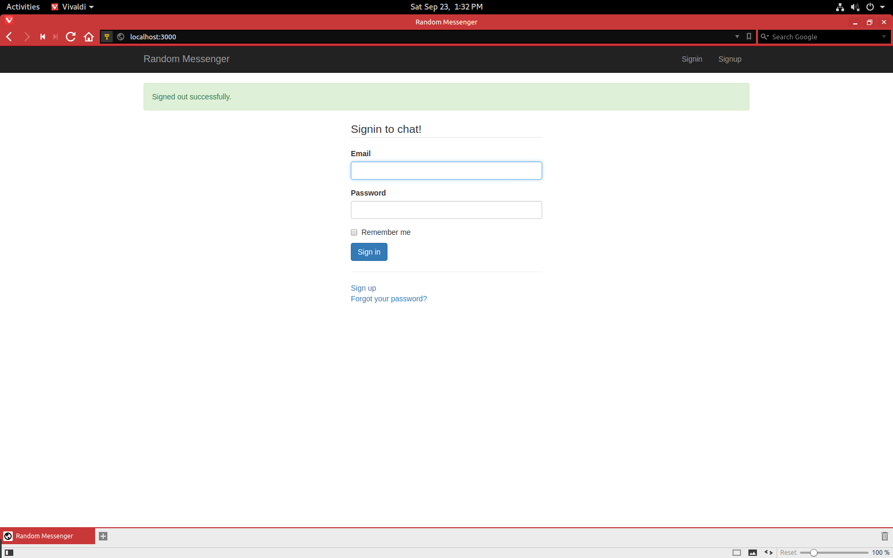
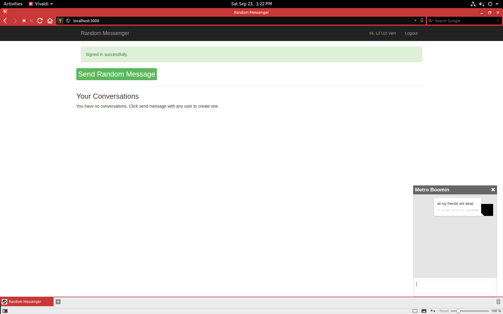
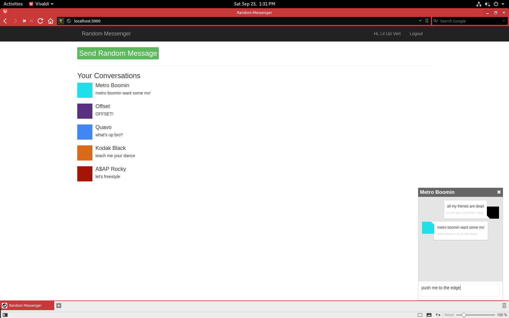

# Random Messenger

## Description
Are you tired of your messaging apps having all these fancy features and options, and just want get back to classic messaging? Do you want to expand your social network and connect with people from all over the world? Well, Random Messenger is the messenger app for you. Random Messenger allows user to chat with random strangers with just the click of a button. The simple interface removes all the distracting options like images, documents, emoji's, stickers, etc. and is strickly only text. This way there is no need to decipher a sequence of emojis or accidentally sending a random sticker. This app is also semi-anonymous, as your username could be whatever you want (i.e. your actual name or a screenname), but profile pictures are replaced with a box filled with the color of your choice.

## Minimum Viable Product
The MVP for this application should allow users to sign up, login, and logout and send a message to a random user. The MVP should also be able to display the messages sent between users and list the conversations that the user is a part of. Also, the MVP should allow a user to coninue a conversation that already existed.

## Requirements

* [Ruby 2.3+](https://www.ruby-lang.org/en/)
* [Rails 5+](http://rubyonrails.org)

## Run on Localhost
You will need to open two terminals. In one type the command ```rackup private_pub.ru -s thin -E production```. This is for the publish/subscribe flow for the messages. In the other terminal run:
* ```bundle install```, installs the necessary Ruby gems if not installed
* ```rake assets:precompile```, precomiles javascript, stylesheets, etc.
* ```rake db:reset```, clears and then seeds the database with the information specified in db/seed.rb.

Now, to use the app, run ```rails server``` and navigate to localhost:3000 in your browser of choice.

## Functionality
### Sign Up
To create an account, click the sign up link. You will be prompted to enter your name, email, favorite color (or any color) in hex, and your password. You will see a confirmation on the page that you created an account.



### Login
You can login by entering the email and password you created the account with or with one of the already created accounts specified in the db/seed.rb. You will see a confirmation on the page that you are logged in.



### Logout
Click the logout link to logout. You will see a confirmation on the page that you logged out.



### Send Message
To send a message click the big green button and a chat box will appear to message a randomly selected user that isn't you. If the database isn't seeded you will not be able to send a message because htere won't be any other users.



### Conversations
All your conversations appear on the main page and clicking on the conversation will open a chat box showing the messages between you and that user.


